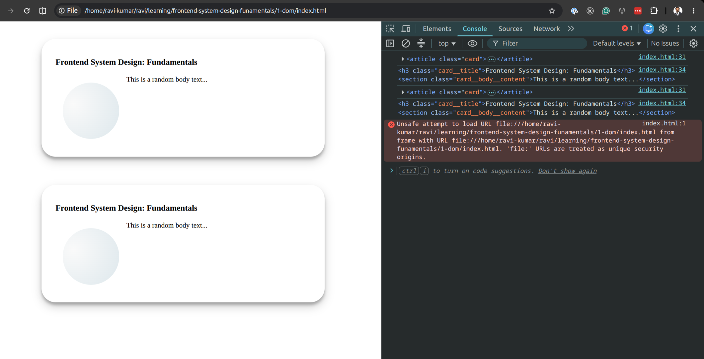

# Basic DOM operations

## Situation

Following a course on master.dev. The situation is to learn about basics of
querying HTML elements from DOM using with best practices. Additionally to learn
about HTML `<template></template>` tag and it's benefits.

## Task

- Implement a JavaScript function to Create a HTML card component.
- Function should accept two params `title, body`
- Given params should be added to respective HTML elements.
- Calling the function should append the card element on the page.

## Actions

- I have created the following files to start with:
  1. `index.html`: With basic HTML5 syntax and added a main container div.
  2. `index.css`: With basic page styles for the page, card, and card elements.
- I have created a HTML `<template>` with id and it contains needed card elements
- I have created a function `createCardComponent(title, body)` with following
  1. fetch the template using `getElementById()`;
  2. clone the template content with `cloneNode()` function with subtree,
  3. query the needed title and body elements using `getElementByTagNames()`
  4. set the `textContent` for the title and body
  5. return updated element
- called the function `.appendChild()` on main container.

## Results

- This could be used to without template using innerHTMl or other traditional way. for example, keeping card HTML template as string in JS and replace the title and body using `.replace()`. However, costs are triggering reflow a bunch of times that leads to performance eventually.
- A function is there to create a new card element with optimized strategy using template tag.
- Learned about `<template>` tag in HTML and practiced dealing with the same in JS.
- One CSS trade-off is b/w `border-box` and `content-box`
  - CSS by defaults sets the `box-sizing: content-box`for the historical and backward compatibility reasons.
  - `content-box` has the behavior to take the full size + given padding and border. Therefore, if the content-box size is 200px and padding 10px and border 5 px. that adds up total as 215px in the page. Whereas `border-box` keeps the size within, i.e. div with 200px width and height + 10px padding + 5px border will take only 200 px in the page. The actual space for the div will be (200 - 10 - 5) = 185px. That helps the developers to calculate the styles precisely.

## Sample output

