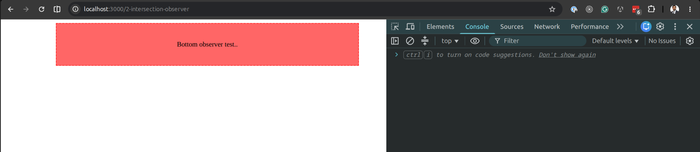
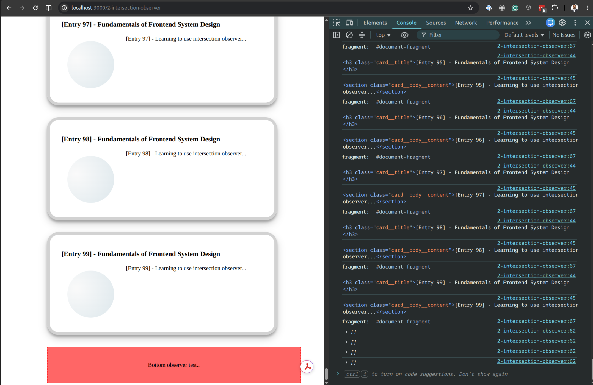

# Intersection Observer

## Overview

Engineers over the years on the Frontend has a pain about the observer topic. Therefore they put a lot of effort and added the Observer API

The mental map

- Observer: Watch for the changes and callback as necessary on the following
  - Intersection: Used for infinite scroll, Interactive UI
  - Mutation: Drawing tool, Rich text editor changes
  - Resize: Updating the UI on resize i.e. charting UI for the stocks, drawing tools,

## Situation

Learning the basics of Intersection observer API in the JS/browser. It has been added since 2016.

## Task

Create a demo that has a observer element under a list. When 20% of observer element is visible (intersects). Load next list items and append to existing list.

## Actions

- Create an observer element on the page. A blank div with dashed border.
- Create an instance of intersection observer to iterate through entries.
- There will be one entry,
- If intersected
- Fetch the paged data by keeping a paged variable
- Create a documentFragment instance that allows to create needed elements in memory and avoid operating in the DOM.
- Iterate over fetched data and append the document fragment.
- When iteration finished. Append the list in DOM
- Keep the threshold to `0.2` that is 20% of intersection

## Result

As a result we will have a infinite scrolling mechanism and load the needed data in chunks, Append the items in memory instead of DOM to avoid reflow trigger to keep the page performant and optimized DOM.

## Sample output

### Begin:

### End:

